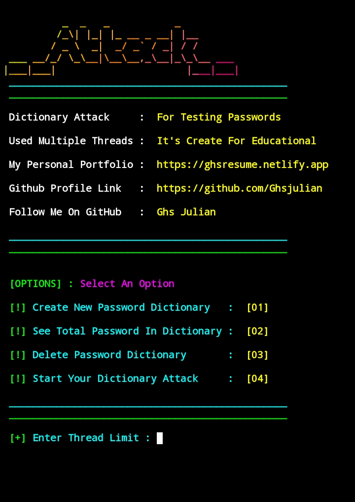
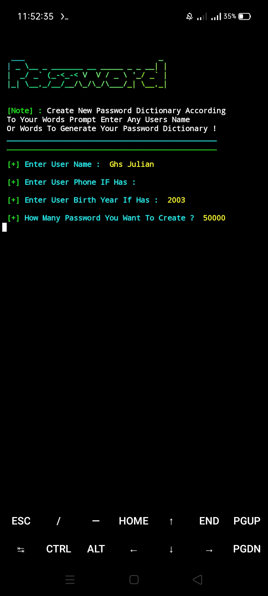
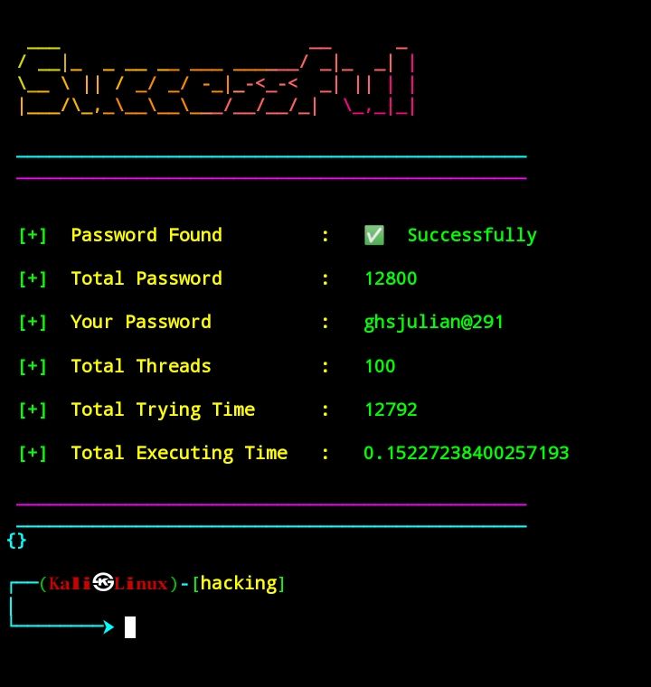
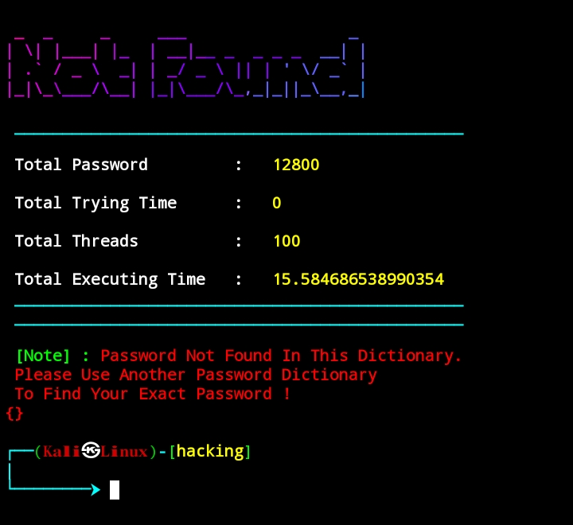

<style>

img {
    border-radius : 8px;
    object-fit : fill;
    margin : .7rem auto ;
}
</style>
<center>
<h1>__Attack__</h1>
<h3>Password Guessing</h3>
<h2 style="color:red">Developer -<span style="color:rgb(30,255,239)"> Ghs Julian</span></h2>
</center>

---

---

<p>

**Hello, This tool has created how you can test your password . You can guess any password randomly , supposed when you enter a words it will create random words according to your input words . After creating the words it will save in to a words.txt file and next time when you start the program it will match.**

---

</p>
<br>
<h2>Read Documention : </h2>
<p>

---

**Let's see how you can use this tools in your Termux terminal . First clone this repository in to your command and follow the steps below.**

</p><br><br>

<h2>Languages And Modules : </h2>
<p>

---

**This Program Is Created By Using Python With Multiple Threading.**

</p><br>

<h2> Cloning Methods : </h2>

---

```bash
git clone https://github.com/Ghsjulian/__Attack__v1.git
cd __Attack__v1
python __run__.py
```

<br>


<h3>Screenshots And Demo : </h3>
<p>

---

**Here's some screenshots of this tools which i have used in my own Termux**

</p>
<center>
<br>
<br>
<br>

</center>

---

---

</p>
<center>
 <h2>Thank You ❤️🙏</h2>
</center>
